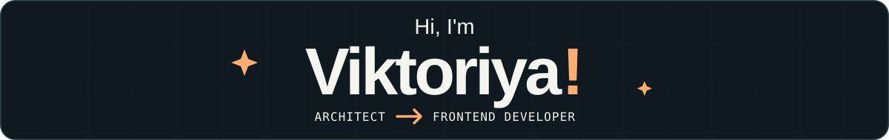

  <picture>
    <source media="(max-width: 600px)" srcset="./assets/hero-dark-mobile.svg" />
    
  </picture>

<h3><code>01</code> &nbsp; A little about me</h3>

  Hi, I’m an <b>architect turned frontend developer</b>. I used to design spaces; now I build interfaces.
  Apparently, changing careers doesn’t cure the urge to fix uneven spacing.

  I enjoy turning ideas into useful apps, figuring out the logic behind them,
  and making interfaces look good and feel easy to use.

  Looking for my <b>first frontend developer role</b>, where I can contribute,
  learn from others, and keep growing.

<h3><code>02</code> &nbsp; Current quest</h3>
<blockquote>
  
<code>IN PROGRESS</code> &nbsp; <b>Fitness tracker</b>

  

    I'm currently working on a <b>fitness-tracking app</b> for my own workouts —
    because “I wish this app had…” eventually turned into “I’ll build it myself.”
  

</blockquote>
<h3><code>03</code> &nbsp; My toolbelt</h3>

<b>Frontend</b> 
  
  
  
  

<b>Layout &amp; styling</b> 
  
  
  

<b>Workflow &amp; testing</b> 
  
  
  
  
  
  

<h3><code>04</code> &nbsp; Side quests</h3>

  Outside of code: strength training, fantasy books, book club discussions,
  video games, and the occasional creative side quest.

  <b>Fun fact:</b> My dad, uncle, aunt, brother, and husband are all programmers.
  I guess it was only a matter of time before I joined the club.

  
<b>Practice log</b> — contributions &amp; Codewars

   
  

    
  

  

    
  

  

    
  

